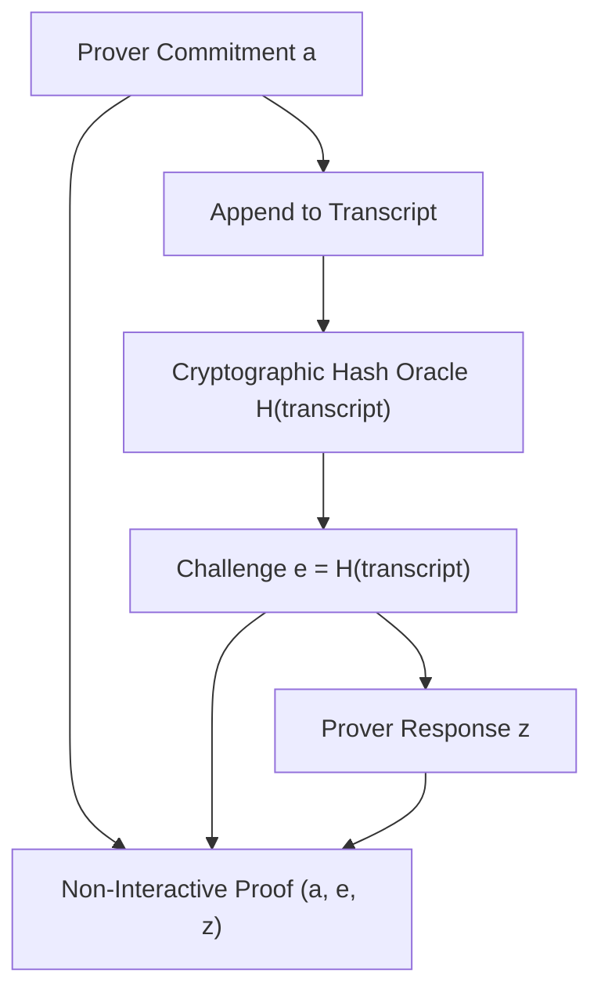

# Fiat-Shamir Heuristic Transformation Skill

High-efficiency, zero-dependency Python implementation of the **Fiat-Shamir Heuristic** converting public-coin interactive protocols into Non-Interactive Zero-Knowledge (NIZK) arguments.

## Features
- **Random Oracle Simulation**: Generates unforgeable verifier challenges from accumulated transcript state.
- **Protocol Non-Interactivity**: Enables prover to synthesize complete verifiable proofs offline.
- **Zero External Dependencies**: Pure Python standard library (`hashlib`).
- **Native MCP Protocol**: JSON-RPC 2.0 stdio server compatible with Claude Desktop, Cursor, and Windsurf.

## Architecture

